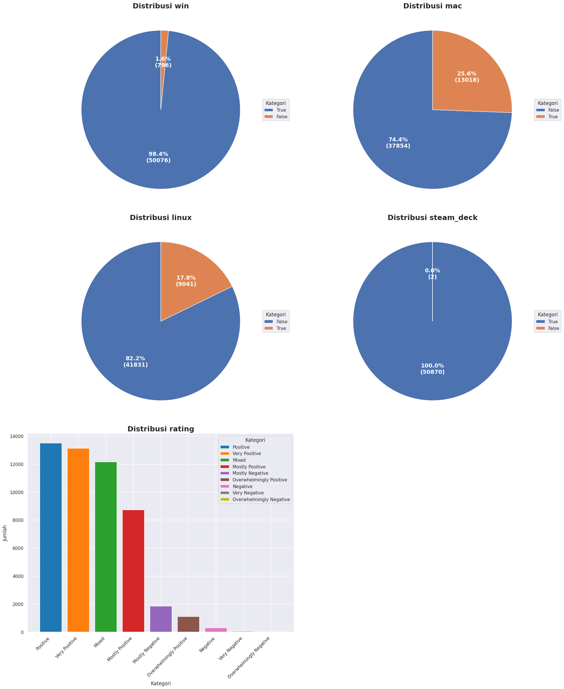
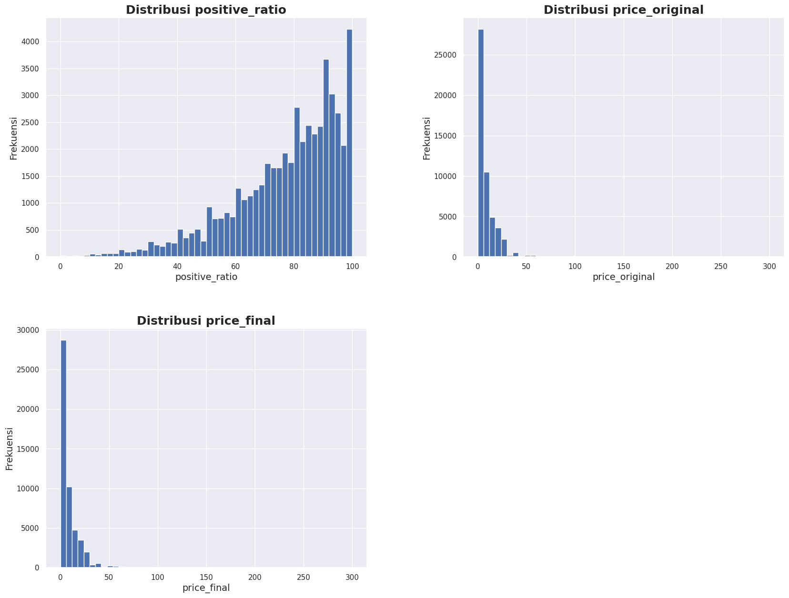
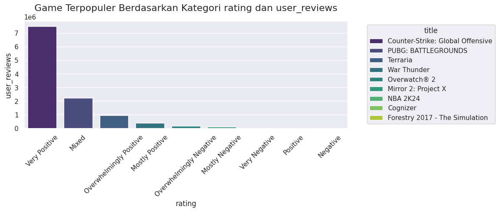
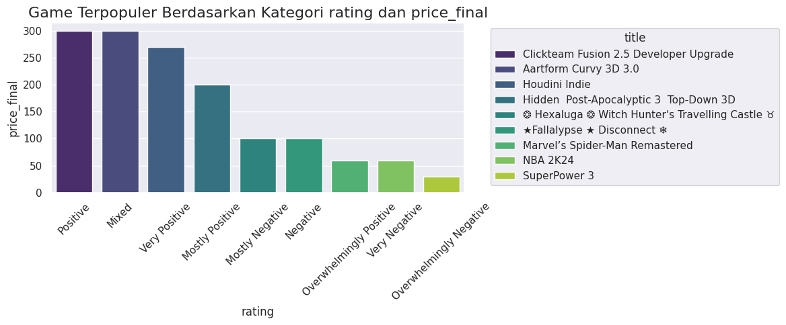
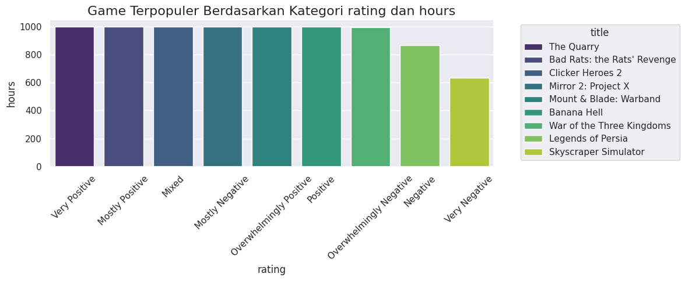
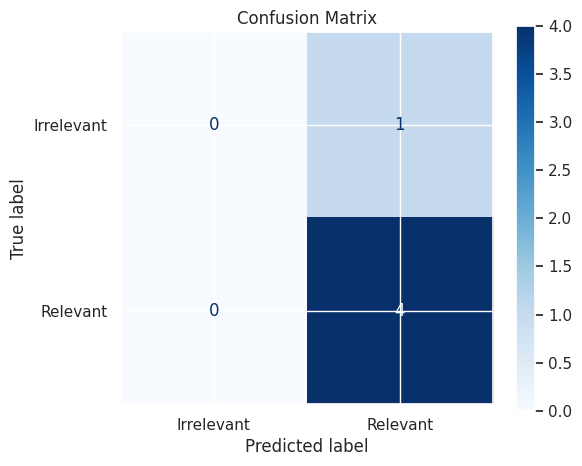
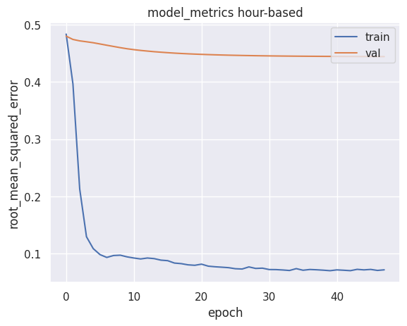
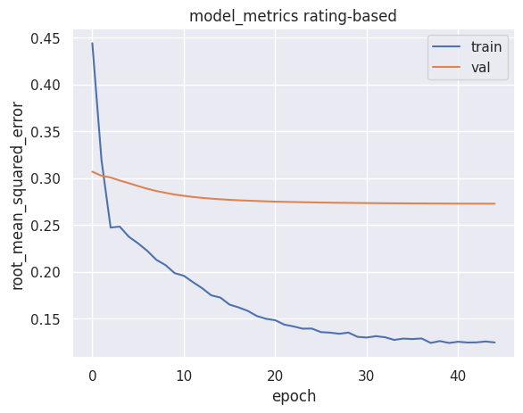

# **Laporan Proyek Machine Learning - Wahyu Azizi**

## **Project Overview**

Perkembangan platform game **Steam** menunjukkan pertumbuhan yang signifikan dalam beberapa tahun terakhir, baik dari segi jumlah game yang tersedia maupun fitur-fitur yang ditawarkan. Steam telah mengalami lonjakan koleksi judul game dalam lima tahun terakhir. Pada tahun 2019, Steam memiliki sekitar 8.134 judul game, yang meningkat menjadi 14.532 judul pada tahun 2023. Hal ini menunjukkan pertumbuhan yang impresif dan menjadikan Steam sebagai salah satu platform dengan koleksi game terluas di industri.[[1](https://eraspace.com/artikel/post/sejumlah-perbandingan-steam-dan-epic-games-mana-yang-terbaik)]

Banyak faktor yang mempengaruhi pertumbuhan platform Steam, salah satunya adalah **sistem rekomendasi** yang dikembangkan pada platform ini. Sistem ini memungkinkan pengguna mendapatkan rekomendasi yang dipersonalisasi. Dengan menggunakan algoritma yang menganalisis preferensi dan perilaku pengguna, platform dapat menawarkan rekomendasi game yang lebih relevan. Ini membantu pengguna menemukan game yang sesuai dengan minat mereka, sehingga meningkatkan kemungkinan mereka untuk melakukan pembelian.[[2](https://www.semanticscholar.org/paper/Implementasi-Chatbot-Telegram-untuk-Meningkatkan-Yuwan-Soelistijadi/fe61864360798ba62bada1ea70b790a0bd6e5f69)]  
Personalisasi memungkinkan interaksi yang lebih baik antara pengguna dan platform. Ketika pengguna merasa bahwa rekomendasi yang diberikan sesuai dengan keinginan mereka, mereka cenderung lebih terlibat dan loyal terhadap platform tersebut.[[3](https://www.semanticscholar.org/paper/Analisis-Penerapan-UI-UX-Dalam-Meningkatkan-Pada-Syafei-Hidayatullah/ca7cfbaa16740716159ba1660203ce012d26ba16)]  

Rekomendasi yang tepat juga dapat meningkatkan tingkat konversi penjualan. Pengguna lebih cenderung membeli game yang direkomendasikan jika mereka merasa bahwa permainan tersebut sesuai dengan preferensi mereka. Dengan demikian, rekomendasi yang relevan dapat meningkatkan pendapatan bagi platform.[[4](https://www.semanticscholar.org/paper/Implementasi-Chatbot-Telegram-untuk-Meningkatkan-Yuwan-Soelistijadi/fe61864360798ba62bada1ea70b790a0bd6e5f69)] Selain itu, pengalaman yang dipersonalisasi membuat pengguna merasa dihargai dan diperhatikan. Hal ini dapat membangun loyalitas jangka panjang terhadap platform, karena pengguna cenderung kembali untuk mencari rekomendasi di masa depan.  
[[5](https://www.semanticscholar.org/paper/Analisis-Penerapan-UI-UX-Dalam-Meningkatkan-Pada-Syafei-Hidayatullah/ca7cfbaa16740716159ba1660203ce012d26ba16)]  

Untuk membangun sistem rekomendasi, terdapat beberapa teknik yang umum digunakan, antara lain:  

1. **Collaborative Filtering (CF):**  
   Pendekatan ini berfokus pada perilaku pengguna dan interaksi antar pengguna untuk memberikan rekomendasi.  

2. **Content-Based Filtering (CBF):**  
   Teknik ini berfokus pada karakteristik item untuk memberikan rekomendasi. Metode ini menganalisis fitur-fitur dari item dan membandingkannya dengan preferensi pengguna. Misalnya, dalam sistem rekomendasi film, CBF mempertimbangkan genre, aktor, dan sutradara dari film yang telah ditonton oleh pengguna sebelumnya.  

Dalam proyek ini, saya akan menggunakan data rekomendasi game pada Steam yang tersedia di Kaggle. Data tersebut akan menjadi dasar dalam membangun sistem rekomendasi berbasis machine learning.  


## **Business Understanding**

### **Problem Statements**

1. Bagaimana cara mengembangkan sistem rekomendasi yang dipersonalisasi untuk platform Steam menggunakan data pengguna?
2. Bagaimana tingkat kepuasan pengguna terhadap game yang dimainkan?
3. Game apa yang populer dimainkan oleh pengguna?

### **Goals**

1. Membuat sistem rekomendasi yang dipersonalisasi untuk platform Steam menggunakan pendekatan Collaborative Filtering dan Content-based Filtering berbasis model deep learning.
2. Mengevaluasi tingkat kepuasan pengguna terhadap game yang dimainkan berdasarkan rasio ulasan positif.
3. Mengidentifikasi game yang paling populer berdasarkan jumlah ulasan, rating, harga dan durasi bermain.

### **Solutions**

#### **1. Pengembangan Sistem Rekomendasi**
- **Pendekatan:**
  - **Collaborative Filtering:** Rekomendasi berdasarkan pola interaksi pengguna dan game.
  - **Content-Based Filtering:** Rekomendasi berdasarkan atribut game, seperti genre dan deskripsi.
- **Implementasi:**
  - Gunakan **deep learning** untuk Collaborative Filtering.
  - Evaluasi model dengan metrik seperti RMSE dan Precision.

#### **2. Eksplorasi Data (EDA)**
- **Analisis Data:**
  - Visualisasikan distribusi data seperti harga game, ulasan, dan durasi bermain.
  - Identifikasi faktor yang memengaruhi harga, ulasan, dan durasi bermain.
- **Tools:**
  - Gunakan **Python** (Pandas, Matplotlib, Seaborn) untuk manipulasi data dan visualisasi.
  - Tampilkan hasil dengan grafik sederhana seperti histogram atau heatmap.

**Hasil yang Diharapkan:**
- Sistem rekomendasi yang relevan untuk pengguna.
- Wawasan faktor-faktor penting yang memengaruhi aspek game di Steam.
## **Data Understanding**

Lakukan proses data understanding, ini termasuk data loading, memeriksa tipe data pada variabel, missing value, dan duplikasi data, setelah itu memberikan detail deskripsi variabel

### **Data Loading**  

Data yang digunakan merupakan data game pada sebuah platform game yaitu Steam. data bisa didapatkan dengan mengklik [link ini](https://www.kaggle.com/datasets/antonkozyriev/game-recommendations-on-steam)


```python
import kagglehub

# Download latest version
path = kagglehub.dataset_download("antonkozyriev/game-recommendations-on-steam")

print("Path to dataset files:", path)
```

    Path to dataset files: /kaggle/input/game-recommendations-on-steam


    Reading games_metadata.json ...
    Reading users.csv ...
    Reading games.csv ...
    Reading recommendations.csv ...
    Selesai!


Di projek ini saya akan menggunakan games_metadata.json, games.csv, dan recommendations.csv

### **Identifikasi Missing Value, Data Duplikasi, dan Tipe Data**

Selanjutnya adalah memeriksa beberapa hal dalam data, seperti missing value, data duplikasi, dan memerika tipe data pada variabel.

#### **df_games**

<table border="1" class="dataframe">
  <thead>
    <tr style="text-align: right;">
      <th></th>
      <th>app_id</th>
      <th>title</th>
      <th>date_release</th>
      <th>win</th>
      <th>mac</th>
      <th>linux</th>
      <th>rating</th>
      <th>positive_ratio</th>
      <th>user_reviews</th>
      <th>price_final</th>
      <th>price_original</th>
      <th>discount</th>
      <th>steam_deck</th>
    </tr>
  </thead>
  <tbody>
    <tr>
      <th>0</th>
      <td>13500</td>
      <td>Prince of Persia: Warrior Within™</td>
      <td>2008-11-21</td>
      <td>True</td>
      <td>False</td>
      <td>False</td>
      <td>Very Positive</td>
      <td>84</td>
      <td>2199</td>
      <td>9.99</td>
      <td>9.99</td>
      <td>0.0</td>
      <td>True</td>
    </tr>
    <tr>
      <th>1</th>
      <td>22364</td>
      <td>BRINK: Agents of Change</td>
      <td>2011-08-03</td>
      <td>True</td>
      <td>False</td>
      <td>False</td>
      <td>Positive</td>
      <td>85</td>
      <td>21</td>
      <td>2.99</td>
      <td>2.99</td>
      <td>0.0</td>
      <td>True</td>
    </tr>
    <tr>
      <th>2</th>
      <td>113020</td>
      <td>Monaco: What's Yours Is Mine</td>
      <td>2013-04-24</td>
      <td>True</td>
      <td>True</td>
      <td>True</td>
      <td>Very Positive</td>
      <td>92</td>
      <td>3722</td>
      <td>14.99</td>
      <td>14.99</td>
      <td>0.0</td>
      <td>True</td>
    </tr>
    <tr>
      <th>3</th>
      <td>226560</td>
      <td>Escape Dead Island</td>
      <td>2014-11-18</td>
      <td>True</td>
      <td>False</td>
      <td>False</td>
      <td>Mixed</td>
      <td>61</td>
      <td>873</td>
      <td>14.99</td>
      <td>14.99</td>
      <td>0.0</td>
      <td>True</td>
    </tr>
    <tr>
      <th>4</th>
      <td>249050</td>
      <td>Dungeon of the ENDLESS™</td>
      <td>2014-10-27</td>
      <td>True</td>
      <td>True</td>
      <td>False</td>
      <td>Very Positive</td>
      <td>88</td>
      <td>8784</td>
      <td>11.99</td>
      <td>11.99</td>
      <td>0.0</td>
      <td>True</td>
    </tr>
  </tbody>
</table>
</div>


```python
print(f"Shape: {df_games.shape}\n")
df_games.info()
```

    Shape: (50872, 13)
    
    <class 'pandas.core.frame.DataFrame'>
    RangeIndex: 50872 entries, 0 to 50871
    Data columns (total 13 columns):
     #   Column          Non-Null Count  Dtype  
    ---  ------          --------------  -----  
     0   app_id          50872 non-null  int64  
     1   title           50872 non-null  object 
     2   date_release    50872 non-null  object 
     3   win             50872 non-null  bool   
     4   mac             50872 non-null  bool   
     5   linux           50872 non-null  bool   
     6   rating          50872 non-null  object 
     7   positive_ratio  50872 non-null  int64  
     8   user_reviews    50872 non-null  int64  
     9   price_final     50872 non-null  float64
     10  price_original  50872 non-null  float64
     11  discount        50872 non-null  float64
     12  steam_deck      50872 non-null  bool   
    dtypes: bool(4), float64(3), int64(3), object(3)
    memory usage: 3.7+ MB


```python
print(f"Jumlah Data Duplikasi: {df_games.duplicated().sum()}\n")
pd.DataFrame({'Daftar Missing Value: ': df_games.isnull().sum()})
```

    Jumlah Data Duplikasi: 0
    


<table border="1" class="dataframe">
  <thead>
    <tr style="text-align: right;">
      <th></th>
      <th>Daftar Missing Value:</th>
    </tr>
  </thead>
  <tbody>
    <tr>
      <th>app_id</th>
      <td>0</td>
    </tr>
    <tr>
      <th>title</th>
      <td>0</td>
    </tr>
    <tr>
      <th>date_release</th>
      <td>0</td>
    </tr>
    <tr>
      <th>win</th>
      <td>0</td>
    </tr>
    <tr>
      <th>mac</th>
      <td>0</td>
    </tr>
    <tr>
      <th>linux</th>
      <td>0</td>
    </tr>
    <tr>
      <th>rating</th>
      <td>0</td>
    </tr>
    <tr>
      <th>positive_ratio</th>
      <td>0</td>
    </tr>
    <tr>
      <th>user_reviews</th>
      <td>0</td>
    </tr>
    <tr>
      <th>price_final</th>
      <td>0</td>
    </tr>
    <tr>
      <th>price_original</th>
      <td>0</td>
    </tr>
    <tr>
      <th>discount</th>
      <td>0</td>
    </tr>
    <tr>
      <th>steam_deck</th>
      <td>0</td>
    </tr>
  </tbody>
</table>
</div>


Data ```df_games``` memiliki jumlah row sebanyak 50872 row data, dengan total variabel sebanyak 13 variabel. Beberapa tipe data yang ada adalah float, integer, boolean, dan juga object (termasuk string, dan date), tidak ada masalah dalam tipe data pada data ```df_games```. Selain itu tidak ditemukan data yang hilang ataupun terduplikasi.

#### **df_recom**

<table border="1" class="dataframe">
  <thead>
    <tr style="text-align: right;">
      <th></th>
      <th>app_id</th>
      <th>helpful</th>
      <th>funny</th>
      <th>date</th>
      <th>is_recommended</th>
      <th>hours</th>
      <th>user_id</th>
      <th>review_id</th>
    </tr>
  </thead>
  <tbody>
    <tr>
      <th>0</th>
      <td>975370</td>
      <td>0</td>
      <td>0</td>
      <td>2022-12-12</td>
      <td>True</td>
      <td>36.3</td>
      <td>51580</td>
      <td>0</td>
    </tr>
    <tr>
      <th>1</th>
      <td>304390</td>
      <td>4</td>
      <td>0</td>
      <td>2017-02-17</td>
      <td>False</td>
      <td>11.5</td>
      <td>2586</td>
      <td>1</td>
    </tr>
    <tr>
      <th>2</th>
      <td>1085660</td>
      <td>2</td>
      <td>0</td>
      <td>2019-11-17</td>
      <td>True</td>
      <td>336.5</td>
      <td>253880</td>
      <td>2</td>
    </tr>
    <tr>
      <th>3</th>
      <td>703080</td>
      <td>0</td>
      <td>0</td>
      <td>2022-09-23</td>
      <td>True</td>
      <td>27.4</td>
      <td>259432</td>
      <td>3</td>
    </tr>
    <tr>
      <th>4</th>
      <td>526870</td>
      <td>0</td>
      <td>0</td>
      <td>2021-01-10</td>
      <td>True</td>
      <td>7.9</td>
      <td>23869</td>
      <td>4</td>
    </tr>
  </tbody>
</table>
</div>


```python
print(f"Shape: {df_recom.shape}\n")

df_recom.info()
```

    Shape: (41154794, 8)
    
    <class 'pandas.core.frame.DataFrame'>
    RangeIndex: 41154794 entries, 0 to 41154793
    Data columns (total 8 columns):
     #   Column          Dtype  
    ---  ------          -----  
     0   app_id          int64  
     1   helpful         int64  
     2   funny           int64  
     3   date            object 
     4   is_recommended  bool   
     5   hours           float64
     6   user_id         int64  
     7   review_id       int64  
    dtypes: bool(1), float64(1), int64(5), object(1)
    memory usage: 2.2+ GB


```python
print(f"Jumlah Data Duplikasi: {df_recom.duplicated().sum()}\n")
pd.DataFrame({'Daftar Missing Value: ': df_recom.isnull().sum()})
```

    Jumlah Data Duplikasi: 0
    


<table border="1" class="dataframe">
  <thead>
    <tr style="text-align: right;">
      <th></th>
      <th>Daftar Missing Value:</th>
    </tr>
  </thead>
  <tbody>
    <tr>
      <th>app_id</th>
      <td>0</td>
    </tr>
    <tr>
      <th>helpful</th>
      <td>0</td>
    </tr>
    <tr>
      <th>funny</th>
      <td>0</td>
    </tr>
    <tr>
      <th>date</th>
      <td>0</td>
    </tr>
    <tr>
      <th>is_recommended</th>
      <td>0</td>
    </tr>
    <tr>
      <th>hours</th>
      <td>0</td>
    </tr>
    <tr>
      <th>user_id</th>
      <td>0</td>
    </tr>
    <tr>
      <th>review_id</th>
      <td>0</td>
    </tr>
  </tbody>
</table>
</div>


```df_recom``` merupakan data rekomendasi pada game, memiliki total row sebanyak 41154794 row, dan memiliki 8 variabel. Tidak ada masalah pada tipe data pada variabel, dan juga tidak ditemukan missing value dan data yang terduplikasi.

#### **df_meta**

<table border="1" class="dataframe">
  <thead>
    <tr style="text-align: right;">
      <th></th>
      <th>app_id</th>
      <th>description</th>
      <th>tags</th>
    </tr>
  </thead>
  <tbody>
    <tr>
      <th>0</th>
      <td>13500</td>
      <td>Enter the dark underworld of Prince of Persia ...</td>
      <td>[Action, Adventure, Parkour, Third Person, Gre...</td>
    </tr>
    <tr>
      <th>1</th>
      <td>22364</td>
      <td></td>
      <td>[Action]</td>
    </tr>
    <tr>
      <th>2</th>
      <td>113020</td>
      <td>Monaco: What's Yours Is Mine is a single playe...</td>
      <td>[Co-op, Stealth, Indie, Heist, Local Co-Op, St...</td>
    </tr>
    <tr>
      <th>3</th>
      <td>226560</td>
      <td>Escape Dead Island is a Survival-Mystery adven...</td>
      <td>[Zombies, Adventure, Survival, Action, Third P...</td>
    </tr>
    <tr>
      <th>4</th>
      <td>249050</td>
      <td>Dungeon of the Endless is a Rogue-Like Dungeon...</td>
      <td>[Roguelike, Strategy, Tower Defense, Pixel Gra...</td>
    </tr>
  </tbody>
</table>
</div>


```python
print(f"Shape: {df_meta.shape}\n")

df_meta.info()
```

    Shape: (50872, 3)
    
    <class 'pandas.core.frame.DataFrame'>
    RangeIndex: 50872 entries, 0 to 50871
    Data columns (total 3 columns):
     #   Column       Non-Null Count  Dtype 
    ---  ------       --------------  ----- 
     0   app_id       50872 non-null  int64 
     1   description  50872 non-null  object
     2   tags         50872 non-null  object
    dtypes: int64(1), object(2)
    memory usage: 1.2+ MB


Sebelum mengidentifikasi data duplikasi, perlu diperhatikan bahwa value pada variabel ```tags``` adalah dalam bentuk list, untuk itu variabel ini harus diubah menjadi string


<table border="1" class="dataframe">
  <thead>
    <tr style="text-align: right;">
      <th></th>
      <th>app_id</th>
      <th>description</th>
      <th>tags</th>
    </tr>
  </thead>
  <tbody>
    <tr>
      <th>16563</th>
      <td>1515740</td>
      <td>Volley, Tennis or Soccer - choose your favorit...</td>
      <td>Football (Soccer) Sports Casual Arcade Tennis ...</td>
    </tr>
    <tr>
      <th>47209</th>
      <td>1918970</td>
      <td>Eresys is a co-op horror game inspired from th...</td>
      <td>Action Horror Online Co-Op Adventure Multiplay...</td>
    </tr>
    <tr>
      <th>28424</th>
      <td>1920820</td>
      <td>唐风还是和风，野史还是仙侠，一款全新画风的仙侠游戏等你来体验。</td>
      <td>RPG Casual Mythology Action RPG 3D Platformer ...</td>
    </tr>
    <tr>
      <th>38197</th>
      <td>1244380</td>
      <td>Pirates? Pirates! is a Reigns-inspired pirate ...</td>
      <td>Casual RPG Strategy Adventure Indie Card Game ...</td>
    </tr>
    <tr>
      <th>24458</th>
      <td>1600890</td>
      <td>This is a click game with horror theme to find...</td>
      <td>Psychological Horror Hidden Object Hand-drawn ...</td>
    </tr>
  </tbody>
</table>
</div>


```python
print(f"Jumlah Data Duplikasi: {df_meta.duplicated().sum()}\n")
pd.DataFrame({'Daftar Missing Value: ': df_meta.isnull().sum()})
```

    Jumlah Data Duplikasi: 0
    


<table border="1" class="dataframe">
  <thead>
    <tr style="text-align: right;">
      <th></th>
      <th>Daftar Missing Value:</th>
    </tr>
  </thead>
  <tbody>
    <tr>
      <th>app_id</th>
      <td>0</td>
    </tr>
    <tr>
      <th>description</th>
      <td>0</td>
    </tr>
    <tr>
      <th>tags</th>
      <td>1244</td>
    </tr>
  </tbody>
</table>
</div>


data pada ```df_meta``` sendiri memiliki total row sebanyak 50872 entries, dengan jumlah variabel sebanyak 3 variabel. Tidak ada masalah pada tipe data, data duplikasi juga nol, tapi terdapat nilai pada variabel tags yang hilang, sebanyak 1244 tags.

___

Menggabungkan beberapa data menjadi satu sebelum melakukan analysis dan data preparation, serta identifikasi missing value.


```python
df_games_rec.isna().sum()
```


    app_id                0
    title                 0
    date_release          0
    win                   0
    mac                   0
    linux                 0
    rating                0
    positive_ratio        0
    user_reviews          0
    price_final           0
    price_original        0
    discount              0
    steam_deck            0
    helpful           13262
    funny             13262
    date              13262
    is_recommended    13262
    hours             13262
    user_id           13262
    review_id         13262
    dtype: int64


```python
df_games_meta.isna().sum()
```


    app_id               0
    title                0
    date_release         0
    win                  0
    mac                  0
    linux                0
    rating               0
    positive_ratio       0
    user_reviews         0
    price_final          0
    price_original       0
    discount             0
    steam_deck           0
    description          0
    tags              1244
    dtype: int64


### **Exploratory Data Analysis - Deskripsi Variabel**

Berikut daftar deksripsi variabel yang ada pada data yang sudah di load.

#### df_games
| **Nama Variabel**   | **Deskripsi**                                                                 |
|----------------------|-----------------------------------------------------------------------------|
| `app_id`            | ID unik untuk setiap game.                                                 |
| `title`             | Judul dari game.                                                          |
| `date_release`      | Tanggal rilis game dalam format `YYYY-MM-DD`.                             |
| `win`               | Apakah game tersedia untuk platform Windows (`True/False`).               |
| `mac`               | Apakah game tersedia untuk platform MacOS (`True/False`).                |
| `linux`             | Apakah game tersedia untuk platform Linux (`True/False`).                |
| `rating`            | Peringkat keseluruhan dari game berdasarkan ulasan pengguna (e.g., Very Positive). |
| `positive_ratio`    | Persentase ulasan positif dari total ulasan.                              |
| `user_reviews`      | Jumlah total ulasan pengguna untuk game tersebut.                         |
| `price_final`       | Harga akhir setelah diskon (jika ada).                                    |
| `price_original`    | Harga asli sebelum diskon.                                                |
| `discount`          | Besarnya diskon dalam bentuk persentase.                                  |
| `steam_deck`        | Apakah game kompatibel dengan Steam Deck (`True/False`).                  |

---

#### df_recommendation
| **Nama Variabel**   | **Deskripsi**                                                        |
|----------------------|----------------------------------------------------------------------|
| `app_id`            | ID unik untuk game yang diulas.                                     |
| `helpful`           | Jumlah vote "membantu" pada ulasan tersebut.                        |
| `funny`             | Jumlah vote "lucu" pada ulasan tersebut.                            |
| `date`              | Tanggal ulasan dibuat dalam format `YYYY-MM-DD`.                    |
| `is_recommended`    | Apakah pengguna merekomendasikan game tersebut (`True/False`).      |
| `hours`             | Jumlah waktu yang dihabiskan untuk memainkan game tersebut (dalam jam). |
| `user_id`           | ID unik dari pengguna yang memberikan ulasan.                      |
| `review_id`         | ID unik untuk ulasan tertentu.                                      |

---

#### df_metadata
| **Nama Variabel**   | **Deskripsi**                                                               |
|----------------------|---------------------------------------------------------------------------|
| `app_id`            | ID unik untuk setiap game.                                               |
| `description`       | Deskripsi singkat tentang game.                                          |
| `tags`              | Kategori atau tag yang terkait dengan game, seperti genre dan fitur.     |


### **Exploratory Data Analysis - Univariate Analysis**  

Berikut distribusi untuk kategorical features, pada data bisa diketahui bahwa 98% lebih game yang terdapat pada platform Steam mendukung system operasi Windows, sedang sebanyak 75% game tersedia untuk system operasi Mac, dan 82,2% game tersedia dalam system operasi Linux, dan yang terakhir adalah hampir semua game mendukung steam deck.
Distribusi untuk kategori rating dapat disimpulkan bahwa kebanyakan game pada Steam dengan rating positive, artinya Steam sangat memperhatikan game yang masuk kedalam platform mereka.

    

    


Pada numerical features, yang pertama distribusi dari variable positive_ratio sangat menunjukkan hal positive karna banyaknya rating yang positive sehingga rasio positive yang tinggi juga sangat banyak. Untuk variable price original dan price final, tidak menunjukkan perbedaan yang signifikan, dan ternyata sangat banyak game dengan Harga yang relative rendah bahkan gratis.


    

    


### **Exploratory Data Analysis - Multivariate Analysis**

Selanjutnya, menganalisis game popular berdasarkan beberapa kategori yang berhubungan dengan melakukan analisis ultivariat. Pertama Game terpopuler berdasarkan kategori rating terhadap user_review dimana rating ```Very Positive``` sangat dominan dengan jumlah lebih dari 7e6 user review, beberapa game dalam kategori ini yaitu ```Counter-Strike: Global Offensive``` dengan urutan teratas, diikuti oleh game ```PUBG, dan Terraria``` sebagai top tiga game teratas dari kategori ini.
Selanjutnya berdasarkan rating terhadap price_final, aplikasi teratas adalah ```Clickteam Fusion 2.5 Developer Upgrade``` dengan harga 300 dollar, diikuti oleh software ```Aart Curvy 3D 3.0 dan Houdini Indie```, akan tetapi aplikasi ini mendapat rating yang positive.
Dan terakhir adalah game teratas berdasarkan total jam bermain, dimana ```The Quarry, Bad Rats: the Rat's Revenge, Clicker Heroes 2``` menjadi top tiga game dengan jumlah hours tertinggi dan dengan rating yang sangat positive.

    

    


    

    


    

    


## **Data Preparation**

### **Preparation for Content-Based Filtering**

Waktunya mempersiapkan data untuk mengembangkan model machine learning agar bisa digunakan dengan maksimal. Sebelum itu, dikarenakan terbatasnya memori yang bisa digunakan untuk memproses data yang sangat banyak ini, terlebih dahulu dilakukannya filtering data dengan mengambil beberapa sample data, disini menggunakan data mulai dari tahun 2020, kemudian hanyak mengambil sample 10000 dari data tersebut, sehingga yang awalnya data dengan total rows 25880823 menjadi 36700 lalu mengambil 10000 dari data tersebut. Selanjutnya memilih variabel-variabel yang dibutuhkan dalam content-based filtering ini, diantaranya yaitu ```app_id, title, win, mac, Linux, rating, tags```.


    Number of rows after date filtering: 25880823


<table border="1" class="dataframe">
  <thead>
    <tr style="text-align: right;">
      <th></th>
      <th>app_id</th>
      <th>helpful</th>
      <th>funny</th>
      <th>date</th>
      <th>is_recommended</th>
      <th>hours</th>
      <th>user_id</th>
      <th>review_id</th>
    </tr>
  </thead>
  <tbody>
    <tr>
      <th>0</th>
      <td>975370</td>
      <td>0</td>
      <td>0</td>
      <td>2022-12-12</td>
      <td>True</td>
      <td>36.3</td>
      <td>51580</td>
      <td>0</td>
    </tr>
    <tr>
      <th>3</th>
      <td>703080</td>
      <td>0</td>
      <td>0</td>
      <td>2022-09-23</td>
      <td>True</td>
      <td>27.4</td>
      <td>259432</td>
      <td>3</td>
    </tr>
    <tr>
      <th>4</th>
      <td>526870</td>
      <td>0</td>
      <td>0</td>
      <td>2021-01-10</td>
      <td>True</td>
      <td>7.9</td>
      <td>23869</td>
      <td>4</td>
    </tr>
    <tr>
      <th>5</th>
      <td>306130</td>
      <td>0</td>
      <td>0</td>
      <td>2021-10-10</td>
      <td>True</td>
      <td>8.6</td>
      <td>45425</td>
      <td>5</td>
    </tr>
    <tr>
      <th>7</th>
      <td>730</td>
      <td>0</td>
      <td>0</td>
      <td>2021-11-30</td>
      <td>False</td>
      <td>157.5</td>
      <td>63209</td>
      <td>7</td>
    </tr>
  </tbody>
</table>
</div>


    Jumlah baris di df_games_meta se: 36700


    Jumlah data setelah drop missing value: (36123, 15)


```python
df_games_meta = df_games_meta[:10000]
```


```python
df_content_based = df_games_meta[['app_id', 'title', 'win', 'mac', 'linux', 'rating', 'tags']]
```

### **TF-IDF Vectorizer**

TF-IDF (Term Frequency - Inverse Document Frequency) adalah metode yang digunakan dalam pemrosesan bahasa alami (NLP) untuk mengubah teks menjadi representasi numerik berdasarkan pentingnya kata dalam sebuah dokumen relatif terhadap koleksi dokumen (corpus).TF-IDF digunakan dalam berbagai aplikasi seperti information retrieval, text mining, dan machine learning untuk NLP.  

**1. Apa Itu TF-IDF?**
**TF-IDF (Term Frequency - Inverse Document Frequency)** adalah metode yang digunakan dalam pemrosesan bahasa alami (**NLP**) untuk mengubah teks menjadi representasi numerik berdasarkan pentingnya kata dalam sebuah dokumen relatif terhadap koleksi dokumen (*corpus*).  

TF-IDF digunakan dalam berbagai aplikasi seperti **information retrieval**, **text mining**, dan **machine learning untuk NLP**.

---

**2. Rumus TF-IDF**
**a) Term Frequency (TF)**
Menunjukkan seberapa sering kata muncul dalam sebuah dokumen.  

$$
TF(t, d) = \frac{f(t, d)}{N}
$$

- \( f(t, d) \) = jumlah kemunculan kata \( t \) dalam dokumen \( d \)
- \( N \) = total jumlah kata dalam dokumen \( d \)

**b) Inverse Document Frequency (IDF)**
Mengukur seberapa penting kata dalam keseluruhan koleksi dokumen.  

$$
IDF(t) = \log{\frac{D}{1 + DF(t)}}
$$

- \( D \) = total jumlah dokumen dalam corpus
- \( DF(t) \) = jumlah dokumen yang mengandung kata \( t \)
- Ditambahkan **+1** dalam penyebut untuk menghindari pembagian dengan nol.

**c) TF-IDF Score**
Dihitung dengan mengalikan nilai TF dan IDF:

$$
TF\text{-}IDF(t, d) = TF(t, d) \times IDF(t)
$$

Semakin tinggi nilai **TF-IDF**, semakin penting kata tersebut dalam dokumen.

dari hasi yang ditunjukkan pada table, tags family dimiliki oleh game King of Retail dan Tamarin, selain itu Tamarin memiliki tag stylized, controller dan metroidvania. ini hanya beberapa contoh ayng dapat ditampilkan.


    array(['1980s', '1990', '2d', '360', '3d', '40k', '4x', '5d', '6dof',
           'abstract', 'access', 'action', 'addictive', 'adventure',
           'agriculture', 'aliens', 'alternate', 'ambient', 'america',
           'american', 'and', 'animation', 'anime', 'apocalyptic', 'arcade',
           'archery', 'arena', 'artificial', 'arts', 'assassin', 'asymmetric',
           'asynchronous', 'atmospheric', 'attack', 'atv', 'audio', 'auto',
           'automation', 'automobile', 'awkward', 'base', 'baseball', 'based',
           'basketball', 'battle', 'battler', 'beat', 'beautiful',
           'benchmark', 'bikes', 'bit', 'blood', 'bmx', 'board', 'book',
           'boss', 'bowling', 'boxing', 'builder', 'building', 'bullet',
           'campaign', 'capitalism', 'card', 'cartoon', 'cartoony', 'casual',
           'cats', 'character', 'chess', 'choices', 'choose', 'cinematic',
           'city', 'class', 'classic', 'click', 'clicker', 'co', 'cold',
           'collectathon', 'collector', 'colony', 'colorful', 'combat',
           'comedy', 'comic', 'competitive', 'conspiracy', 'content',
           'control', 'controller', 'controls', 'conversation', 'cooking',
           'cozy', 'craft', 'crafting', 'crawler', 'creature', 'cricket',
           'crime', 'crowdfunded', 'crpg', 'cult', 'customization', 'cute',
           'cyberpunk', 'cycling', 'dark', 'dating', 'death', 'deckbuilder',
           'deckbuilding', 'deduction', 'defense', 'demons', 'design',
           'destruction', 'detective', 'development', 'difficult',
           'dinosaurs', 'diplomacy', 'documentary', 'dog', 'down', 'dragons',
           'drama', 'drawn', 'driving', 'dungeon', 'dungeons', 'dynamic',
           'dystopian', 'early', 'economy', 'editing', 'editor', 'education',
           'electronic', 'em', 'emotional', 'endings', 'epic', 'episodic',
           'escape', 'esports', 'events', 'experience', 'experimental',
           'exploration', 'faith', 'family', 'fantasy', 'farming', 'fast',
           'feature', 'female', 'fi', 'fiction', 'fighter', 'fighting',
           'film', 'first', 'fishing', 'flight', 'fmv', 'football', 'foreign',
           'fps', 'free', 'friendly', 'funny', 'futuristic', 'gambling',
           'game', 'gamemaker', 'games', 'gaming', 'generation', 'god',
           'golf', 'gore', 'gothic', 'grand', 'graphics', 'great', 'grid',
           'gun', 'hack', 'hacking', 'hand', 'hardware', 'heist', 'hell',
           'hentai', 'hero', 'hex', 'hidden', 'historical', 'history',
           'hobby', 'hockey', 'horror', 'horses', 'humor', 'hunting', 'idler',
           'ii', 'illuminati', 'illustration', 'immersive', 'indie',
           'instrumental', 'intelligence', 'intentionally', 'interactive',
           'inventory', 'investigation', 'isometric', 'jet', 'job', 'jrpg',
           'jump', 'keeper', 'kickstarter', 'lego', 'lemmings', 'level',
           'lgbtq', 'life', 'like', 'linear', 'local', 'logic', 'loot',
           'looter', 'lore', 'lovecraftian', 'machine', 'magic', 'mahjong',
           'management', 'manipulation', 'mars', 'martial', 'massively',
           'match', 'matter', 'mature', 'mechs', 'medical', 'medieval',
           'memes', 'metroidvania', 'military', 'mini', 'minigames',
           'minimalist', 'mining', 'mmorpg', 'moba', 'mod', 'moddable',
           'modeling', 'modern', 'motocross', 'motorbike', 'mouse',
           'movement', 'movie', 'multiplayer', 'multiple', 'music', 'musou',
           'mystery', 'mythology', 'narration', 'narrative', 'nature',
           'naval', 'ninja', 'noir', 'nonlinear', 'nostalgia', 'novel',
           'nsfw', 'nudity', 'object', 'offroad', 'old', 'on', 'online',
           'only', 'op', 'open', 'otome', 'outbreak', 'own', 'paced',
           'parkour', 'parody', 'party', 'pause', 'perma', 'person',
           'philosophical', 'photo', 'physics', 'pinball', 'pirates', 'pixel',
           'platformer', 'play', 'player', 'point', 'political', 'politics',
           'pool', 'post', 'precision', 'procedural', 'production',
           'programming', 'protagonist', 'psychedelic', 'psychological',
           'publishing', 'puzzle', 'pve', 'pvp', 'quick', 'racing', 'rails',
           'real', 'realistic', 'reboot', 'relaxing', 'remake', 'replay',
           'resource', 'retro', 'rhythm', 'rich', 'robots', 'rock',
           'roguelike', 'roguelite', 'roguevania', 'romance', 'rome', 'room',
           'royale', 'rpg', 'rpgmaker', 'rts', 'rugby', 'runner', 'rush',
           'sailing', 'sandbox', 'satire', 'scare', 'school', 'sci',
           'science', 'score', 'screen', 'scroller', 'sequel', 'sexual',
           'shoot', 'shooter', 'shop', 'short', 'side', 'silent', 'sim',
           'simulation', 'simulator', 'singleplayer', 'skateboarding',
           'skating', 'skiing', 'slash', 'sniper', 'snooker', 'snow',
           'snowboarding', 'soccer', 'social', 'software', 'sokoban',
           'solitaire', 'souls', 'soundtrack', 'space', 'spaceships',
           'spectacle', 'spelling', 'split', 'sports', 'stealth', 'steam',
           'steampunk', 'stick', 'story', 'strategy', 'stylized', 'submarine',
           'superhero', 'supernatural', 'surreal', 'survival', 'swordplay',
           'tabletop', 'tactical', 'tactics', 'tanks', 'team', 'tennis',
           'text', 'third', 'thriller', 'time', 'to', 'top', 'touch', 'tower',
           'trackir', 'trading', 'traditional', 'training', 'trains',
           'transhumanism', 'transportation', 'travel', 'trivia', 'turn',
           'tutorial', 'twin', 'typing', 'underground', 'underwater',
           'unforgiving', 'up', 'utilities', 'value', 'vampire', 'vehicular',
           'video', 'vikings', 'villain', 'violent', 'vision', 'visual',
           'voice', 'volleyball', 'voxel', 'vr', 'walking', 'war', 'wargame',
           'warhammer', 'web', 'well', 'werewolves', 'western', 'wholesome',
           'with', 'word', 'workshop', 'world', 'wrestling', 'written',
           'your', 'zombies'], dtype=object)


<table border="1" class="dataframe">
  <thead>
    <tr style="text-align: right;">
      <th></th>
      <th>replay</th>
      <th>procedural</th>
      <th>choose</th>
      <th>vikings</th>
      <th>audio</th>
      <th>walking</th>
      <th>idler</th>
      <th>touch</th>
      <th>swordplay</th>
      <th>choices</th>
    </tr>
    <tr>
      <th>title</th>
      <th></th>
      <th></th>
      <th></th>
      <th></th>
      <th></th>
      <th></th>
      <th></th>
      <th></th>
      <th></th>
      <th></th>
    </tr>
  </thead>
  <tbody>
    <tr>
      <th>Math Fun</th>
      <td>0.0</td>
      <td>0.0</td>
      <td>0.0</td>
      <td>0.0</td>
      <td>0.0</td>
      <td>0.00000</td>
      <td>0.0</td>
      <td>0.0</td>
      <td>0.0</td>
      <td>0.000000</td>
    </tr>
    <tr>
      <th>Exorcist</th>
      <td>0.0</td>
      <td>0.0</td>
      <td>0.0</td>
      <td>0.0</td>
      <td>0.0</td>
      <td>0.00000</td>
      <td>0.0</td>
      <td>0.0</td>
      <td>0.0</td>
      <td>0.180559</td>
    </tr>
    <tr>
      <th>KILLRUN</th>
      <td>0.0</td>
      <td>0.0</td>
      <td>0.0</td>
      <td>0.0</td>
      <td>0.0</td>
      <td>0.00000</td>
      <td>0.0</td>
      <td>0.0</td>
      <td>0.0</td>
      <td>0.000000</td>
    </tr>
    <tr>
      <th>Hocus Pocus</th>
      <td>0.0</td>
      <td>0.0</td>
      <td>0.0</td>
      <td>0.0</td>
      <td>0.0</td>
      <td>0.00000</td>
      <td>0.0</td>
      <td>0.0</td>
      <td>0.0</td>
      <td>0.000000</td>
    </tr>
    <tr>
      <th>Cats Organized Neatly</th>
      <td>0.0</td>
      <td>0.0</td>
      <td>0.0</td>
      <td>0.0</td>
      <td>0.0</td>
      <td>0.00000</td>
      <td>0.0</td>
      <td>0.0</td>
      <td>0.0</td>
      <td>0.000000</td>
    </tr>
    <tr>
      <th>Doors &amp; Rooms</th>
      <td>0.0</td>
      <td>0.0</td>
      <td>0.0</td>
      <td>0.0</td>
      <td>0.0</td>
      <td>0.00000</td>
      <td>0.0</td>
      <td>0.0</td>
      <td>0.0</td>
      <td>0.000000</td>
    </tr>
    <tr>
      <th>Arelite Core</th>
      <td>0.0</td>
      <td>0.0</td>
      <td>0.0</td>
      <td>0.0</td>
      <td>0.0</td>
      <td>0.00000</td>
      <td>0.0</td>
      <td>0.0</td>
      <td>0.0</td>
      <td>0.000000</td>
    </tr>
    <tr>
      <th>Disc Room</th>
      <td>0.0</td>
      <td>0.0</td>
      <td>0.0</td>
      <td>0.0</td>
      <td>0.0</td>
      <td>0.00000</td>
      <td>0.0</td>
      <td>0.0</td>
      <td>0.0</td>
      <td>0.000000</td>
    </tr>
    <tr>
      <th>Electronic Super Joy</th>
      <td>0.0</td>
      <td>0.0</td>
      <td>0.0</td>
      <td>0.0</td>
      <td>0.0</td>
      <td>0.00000</td>
      <td>0.0</td>
      <td>0.0</td>
      <td>0.0</td>
      <td>0.000000</td>
    </tr>
    <tr>
      <th>The Sojourn</th>
      <td>0.0</td>
      <td>0.0</td>
      <td>0.0</td>
      <td>0.0</td>
      <td>0.0</td>
      <td>0.26627</td>
      <td>0.0</td>
      <td>0.0</td>
      <td>0.0</td>
      <td>0.000000</td>
    </tr>
  </tbody>
</table>
</div>


### **Data Preparation for Collaborative Filtering**  

Selanjutnya membangun sistem rekomendasi dengan pendekatan Collaborative Filtering. Pertama melakukan filtering data untuk mengambil sample dengan rentang tertentu agar cukup memori untuk memproses semua ini. Gunakan fungsi yang sudah dibuat sebelumnya, kemudian merge dengan data games untuk mengambil feature yang akan diproses nantinya.


    Number of rows after date filtering: 25880823


<table border="1" class="dataframe">
  <thead>
    <tr style="text-align: right;">
      <th></th>
      <th>app_id</th>
      <th>helpful</th>
      <th>funny</th>
      <th>date</th>
      <th>is_recommended</th>
      <th>hours</th>
      <th>user_id</th>
      <th>review_id</th>
    </tr>
  </thead>
  <tbody>
    <tr>
      <th>0</th>
      <td>975370</td>
      <td>0</td>
      <td>0</td>
      <td>2022-12-12</td>
      <td>True</td>
      <td>36.3</td>
      <td>51580</td>
      <td>0</td>
    </tr>
    <tr>
      <th>3</th>
      <td>703080</td>
      <td>0</td>
      <td>0</td>
      <td>2022-09-23</td>
      <td>True</td>
      <td>27.4</td>
      <td>259432</td>
      <td>3</td>
    </tr>
    <tr>
      <th>4</th>
      <td>526870</td>
      <td>0</td>
      <td>0</td>
      <td>2021-01-10</td>
      <td>True</td>
      <td>7.9</td>
      <td>23869</td>
      <td>4</td>
    </tr>
    <tr>
      <th>5</th>
      <td>306130</td>
      <td>0</td>
      <td>0</td>
      <td>2021-10-10</td>
      <td>True</td>
      <td>8.6</td>
      <td>45425</td>
      <td>5</td>
    </tr>
    <tr>
      <th>7</th>
      <td>730</td>
      <td>0</td>
      <td>0</td>
      <td>2021-11-30</td>
      <td>False</td>
      <td>157.5</td>
      <td>63209</td>
      <td>7</td>
    </tr>
  </tbody>
</table>
</div>


Jangan lupa untuk memilih variabel yang sesuai untuk diproses selanjutnya. Pada Collaborative Filtering ini akan menggunakan fitur ```app_id, user_id, hours, is_recommended, dan rating```


    user_id             int64
    app_id              int64
    hours             float64
    is_recommended       bool
    rating             object
    dtype: object


Setelah itu lakukan proses encode pada beberapa variabel yang diperlukan, seperti rating, app_id, dan user_id. Karna variabel rating merupakan kategorikal dengan total 9 jenis rating, dari Overwhelmingly Negative hingga Overwhelmingly Positive. dari kesembilan rating tersebut akan disandi menjadi numerik dari 1-9, agar bisa diproses oleh model nanti.


<table border="1" class="dataframe">
  <thead>
    <tr style="text-align: right;">
      <th></th>
      <th>user_id</th>
      <th>app_id</th>
      <th>hours</th>
      <th>is_recommended</th>
      <th>rating</th>
    </tr>
  </thead>
  <tbody>
    <tr>
      <th>18564706</th>
      <td>7117632</td>
      <td>888630</td>
      <td>8.2</td>
      <td>True</td>
      <td>5</td>
    </tr>
    <tr>
      <th>18565344</th>
      <td>12354770</td>
      <td>1071330</td>
      <td>3.4</td>
      <td>False</td>
      <td>7</td>
    </tr>
    <tr>
      <th>18824318</th>
      <td>13802638</td>
      <td>511490</td>
      <td>11.0</td>
      <td>True</td>
      <td>4</td>
    </tr>
    <tr>
      <th>21514307</th>
      <td>9169034</td>
      <td>1879750</td>
      <td>2.5</td>
      <td>True</td>
      <td>6</td>
    </tr>
    <tr>
      <th>19658704</th>
      <td>13233798</td>
      <td>541660</td>
      <td>0.6</td>
      <td>False</td>
      <td>7</td>
    </tr>
  </tbody>
</table>
</div>


Selanjutnya melakukan proses encoding user_id dan app_id, kemudian melakukan pemetaan keduanya kedalam dataframe. Selain itu juga memproses rating menjadi float untuk proses selanjutnya dalam proses data normalization


    Encoded user_id: [(8839158, 1863), (9777376, 9790), (8046687, 22616)]
    Encoded angka ke user_id: [(13384, 12362303), (27751, 11285202), (19727, 14105188)]
    Encoded user_id: [(1435700, 17269), (321960, 3005), (596240, 13854)]
    Encoded angka ke user_id: [(3496, 2165740), (1795, 268400), (28718, 494100)]


    num of user: 28334
    num of app: 36700


### **Data Normalization**

Proses transformasi data dalam kode ini terdiri dari dua langkah utama. Pertama, kolom hours dimodifikasi menggunakan metode .apply() dengan conditional weighting. Jika pengguna merekomendasikan suatu item (is_recommended == True), maka nilai hours dikalikan 1.25, memberikan bobot lebih tinggi karena dianggap lebih berharga. Sebaliknya, jika pengguna tidak merekomendasikan, nilai hours dikalikan 0.75, mengurangi pengaruhnya dalam model rekomendasi. Transformasi ini bertujuan untuk menyesuaikan kontribusi waktu bermain terhadap sistem rekomendasi, sehingga jam bermain pengguna yang puas memiliki dampak lebih besar dibandingkan yang tidak puas.

Langkah kedua adalah normalisasi rating menggunakan Min-Max Scaling, di mana nilai rating dikonversi ke skala 0 hingga 1 menggunakan rumus:

$$
X_{\text{normalized}} = \frac{X - X_{\text{min}}}{X_{\text{max}} - X_{\text{min}}}
$$

di mana:
- \( X \) adalah nilai asli yang akan dinormalisasi  
- \( X_{\text{min}} \) adalah nilai minimum dalam dataset  
- \( X_{\text{max}} \) adalah nilai maksimum dalam dataset  
- \( X_{\text{normalized}} \) adalah nilai hasil normalisasi dalam rentang **[0, 1]**  

Normalisasi ini membantu algoritma **Machine Learning dan Collaborative Filtering** agar bekerja lebih optimal dengan data yang memiliki skala seragam.

Setiap rating dikurangi dengan rating minimum dalam dataset (min_rating), kemudian dibagi dengan selisih antara rating maksimum (max_rating) dan minimum. Teknik ini digunakan untuk memastikan bahwa perbedaan skala rating antar pengguna tidak mempengaruhi sistem rekomendasi secara berlebihan, serta meningkatkan kinerja model dalam perhitungan kesamaan (similarity metrics).

Kedua proses ini merupakan bagian dari data preprocessing dalam Collaborative Filtering, yang bertujuan untuk meningkatkan kualitas rekomendasi dengan memastikan bahwa data memiliki bobot yang sesuai dan skala yang seragam.

```python
df_collab_based['hours']= df_collab_based.apply(lambda x: x['hours'] * 1.25 if x['is_recommended'] else x['hours'] * 0.75, axis=1)

scaler = MinMaxScaler()
df_collab_based['hours'] = scaler.fit_transform(df_collab_based[['hours']])

print(df_collab_based['hours'].head())
```

    0    0.036315
    1    0.027411
    2    0.007903
    3    0.008603
    4    0.094538
    Name: hours, dtype: float64


```python
# Membuat variabel x dan y
x = df_collab_based[['user', 'app']].values
y_1 = df_collab_based['hours'].values

y_2 = df_collab_based['rating'].apply(lambda x: (x - min_rating) / (max_rating - min_rating)).values
print(x, y_1, y_2)
```

    [[    0     0]
     [    1     1]
     [    2     2]
     ...
     [28331 36697]
     [28332 36698]
     [28333 36699]] [0.03631453 0.02741096 0.00790316 ... 0.0070028  0.00060024 0.0180072 ] [1.    0.875 1.    ... 0.875 0.875 0.875]


### **Membagi Data untuk Training dan Validasi**

Lakukan split data untuk kedua model yang akan dibangun menggunakan Fungsi ```train_test_split``` dari pustaka ```scikit-learn``` untuk membagi dataset menjadi dua bagian: ```training set``` dan ```validation set```. Ini dilakukan agar model dapat belajar dari training set dan diuji performanya di validation set sebelum digunakan pada data baru.


```python
# Train test split untuk model 1
X_train_h, X_val_h, y_train_h, y_val_h = train_test_split(
    x,
    y_1,
    test_size=0.2,
    random_state=42
)

# Train test split untuk model 2
X_train_r, X_val_r, y_train_r, y_val_r = train_test_split(
    x,
    y_2,
    test_size=0.2,
    random_state=42
)
```

## **Modeling**

### **Content-based Filtering**

#### **Cosine Similarity**
**Cosine Similarity** adalah metode untuk mengukur kesamaan antara dua vektor berdasarkan sudut (*angle*) di antara keduanya dalam ruang berdimensi tinggi.  

Metode ini sering digunakan dalam **text mining**, **information retrieval**, dan **recommender systems** untuk membandingkan dokumen atau item.

**Rumus Cosine Similarity**
Diberikan dua vektor **A** dan **B**, kesamaan kosinus dihitung dengan:

$$
\cos{\theta} = \frac{A \cdot B}{\|A\| \times \|B\|}
$$

Di mana:
- \( A \cdot B \) = **dot product** antara vektor \( A \) dan \( B \)
- \( \|A\| \) = **norma** (panjang) dari vektor \( A \), dihitung sebagai:

$$
\|A\| = \sqrt{\sum_{i=1}^{n} A_i^2}
$$

- \( \|B\| \) = norma dari vektor \( B \)
- \( \theta \) = sudut antara dua vektor

Nilai **Cosine Similarity** berada dalam rentang **\([-1,1]\)**:
- **1** → Vektor identik (sangat mirip)
- **0** → Tidak ada hubungan (ortogonal)
- **-1** → Vektor berlawanan arah (sangat berbeda)


```python
# Hitung cosine similarity pada final_df
cos_sim = cosine_similarity(tfidf_array)
cos_sim
```


    array([[1.        , 0.0846129 , 0.36237341, ..., 0.04086519, 0.05889418,
            0.13977438],
           [0.0846129 , 1.        , 0.24366235, ..., 0.02880241, 0.02688899,
            0.09175015],
           [0.36237341, 0.24366235, 1.        , ..., 0.03129268, 0.06363002,
            0.04235115],
           ...,
           [0.04086519, 0.02880241, 0.03129268, ..., 1.        , 0.02034198,
            0.16041007],
           [0.05889418, 0.02688899, 0.06363002, ..., 0.02034198, 1.        ,
            0.01529888],
           [0.13977438, 0.09175015, 0.04235115, ..., 0.16041007, 0.01529888,
            1.        ]])


Observasi dari Sampel:

- Once Again memiliki nilai tinggi dengan Cris Tales (0.318) dan Duck Life (0.178), menunjukkan adanya kesamaan fitur antar game tersebut.
- Sunrider: Liberation Day - Captain's Edition memiliki kesamaan tertinggi dengan Trap Legend (0.498), menunjukkan bahwa tags mereka mungkin sangat mirip.
- Cooking Festival dan Duck Life memiliki kesamaan relatif tinggi (0.329), mungkin karena tema kasual atau mekanisme gameplay yang mirip.
- Beberapa game seperti Reanimation Inc. dan ZANGEKI WARP memiliki nilai yang sangat rendah (mendekati 0), menunjukkan bahwa game tersebut mungkin sangat berbeda dari lainnya.

```
    Shape: (10000, 10000)
```


<table border="1" class="dataframe">
  <thead>
    <tr style="text-align: right;">
      <th>title</th>
      <th>Penko Park</th>
      <th>Kholat</th>
      <th>Voice of Cards: The Forsaken Maiden</th>
      <th>Kokoro Clover Season1</th>
      <th>风起长安：驭骨人</th>
    </tr>
    <tr>
      <th>title</th>
      <th></th>
      <th></th>
      <th></th>
      <th></th>
      <th></th>
    </tr>
  </thead>
  <tbody>
    <tr>
      <th>Kombi Travels - Jigsaw Landscapes</th>
      <td>0.321898</td>
      <td>0.015005</td>
      <td>0.151610</td>
      <td>0.054627</td>
      <td>0.074780</td>
    </tr>
    <tr>
      <th>Alan Wake</th>
      <td>0.102104</td>
      <td>0.567210</td>
      <td>0.056279</td>
      <td>0.023831</td>
      <td>0.077069</td>
    </tr>
    <tr>
      <th>Vestaria Saga II: The Sacred Sword of Silvanister</th>
      <td>0.000000</td>
      <td>0.025511</td>
      <td>0.070740</td>
      <td>0.070351</td>
      <td>0.165859</td>
    </tr>
    <tr>
      <th>Hero Realms</th>
      <td>0.000000</td>
      <td>0.006948</td>
      <td>0.401512</td>
      <td>0.007841</td>
      <td>0.084560</td>
    </tr>
    <tr>
      <th>Aozora Meikyuu</th>
      <td>0.029599</td>
      <td>0.036950</td>
      <td>0.012824</td>
      <td>0.221865</td>
      <td>0.279115</td>
    </tr>
    <tr>
      <th>Odd Woods</th>
      <td>0.067233</td>
      <td>0.478274</td>
      <td>0.024123</td>
      <td>0.061223</td>
      <td>0.049694</td>
    </tr>
    <tr>
      <th>VRMark</th>
      <td>0.000000</td>
      <td>0.000000</td>
      <td>0.000000</td>
      <td>0.000000</td>
      <td>0.000000</td>
    </tr>
    <tr>
      <th>RHEM II SE: The Cave</th>
      <td>0.023491</td>
      <td>0.045663</td>
      <td>0.023473</td>
      <td>0.051537</td>
      <td>0.046298</td>
    </tr>
    <tr>
      <th>NecroVisioN: Lost Company</th>
      <td>0.039963</td>
      <td>0.288975</td>
      <td>0.000000</td>
      <td>0.019860</td>
      <td>0.084988</td>
    </tr>
    <tr>
      <th>Yet Another Zombie Defense HD</th>
      <td>0.000000</td>
      <td>0.053456</td>
      <td>0.000000</td>
      <td>0.012233</td>
      <td>0.004730</td>
    </tr>
  </tbody>
</table>
</div>


### **Mendapatkan Rekomendasi**


hasil rekomendasi dari system yang dibangun, dengan mencoba menginput data game dengan title BlackJack Math, diperoleh hasil rekomendasi dengan rata-rata similarity scorenya sama dengan 0.65, beberapa game yang direkomendasikan yaitu ```Journey of Greed, Love Letter, Splendor, Avalon Legends Solitaire, Pathfinder Avdentures```


<table border="1" class="dataframe">
  <thead>
    <tr style="text-align: right;">
      <th></th>
      <th>app_id</th>
      <th>title</th>
      <th>date_release</th>
      <th>win</th>
      <th>mac</th>
      <th>linux</th>
      <th>rating</th>
      <th>positive_ratio</th>
      <th>user_reviews</th>
      <th>price_final</th>
      <th>price_original</th>
      <th>discount</th>
      <th>steam_deck</th>
    </tr>
  </thead>
  <tbody>
    <tr>
      <th>2580</th>
      <td>1341220</td>
      <td>BlackJack Math</td>
      <td>2020-08-20</td>
      <td>True</td>
      <td>True</td>
      <td>False</td>
      <td>Very Positive</td>
      <td>88</td>
      <td>60</td>
      <td>0.99</td>
      <td>0.99</td>
      <td>0.0</td>
      <td>True</td>
    </tr>
  </tbody>
</table>
</div>


<table border="1" class="dataframe">
  <thead>
    <tr style="text-align: right;">
      <th></th>
      <th>title</th>
      <th>similarity score</th>
      <th>app_id</th>
      <th>date_release</th>
      <th>win</th>
      <th>mac</th>
      <th>linux</th>
      <th>rating</th>
      <th>positive_ratio</th>
      <th>user_reviews</th>
      <th>price_final</th>
      <th>price_original</th>
      <th>discount</th>
      <th>steam_deck</th>
    </tr>
  </thead>
  <tbody>
    <tr>
      <th>0</th>
      <td>Journey of Greed</td>
      <td>0.666917</td>
      <td>1032790</td>
      <td>2019-10-23</td>
      <td>True</td>
      <td>True</td>
      <td>False</td>
      <td>Very Positive</td>
      <td>90</td>
      <td>1127</td>
      <td>6.99</td>
      <td>6.99</td>
      <td>0.0</td>
      <td>True</td>
    </tr>
    <tr>
      <th>1</th>
      <td>Love Letter</td>
      <td>0.652366</td>
      <td>926520</td>
      <td>2018-10-24</td>
      <td>True</td>
      <td>True</td>
      <td>False</td>
      <td>Very Positive</td>
      <td>89</td>
      <td>174</td>
      <td>6.99</td>
      <td>6.99</td>
      <td>0.0</td>
      <td>True</td>
    </tr>
    <tr>
      <th>2</th>
      <td>Splendor</td>
      <td>0.652366</td>
      <td>376680</td>
      <td>2015-09-17</td>
      <td>True</td>
      <td>False</td>
      <td>False</td>
      <td>Very Positive</td>
      <td>83</td>
      <td>660</td>
      <td>3.99</td>
      <td>9.99</td>
      <td>60.0</td>
      <td>True</td>
    </tr>
    <tr>
      <th>3</th>
      <td>Avalon Legends Solitaire 2</td>
      <td>0.611270</td>
      <td>512260</td>
      <td>2016-10-04</td>
      <td>True</td>
      <td>True</td>
      <td>False</td>
      <td>Very Positive</td>
      <td>88</td>
      <td>50</td>
      <td>9.99</td>
      <td>9.99</td>
      <td>0.0</td>
      <td>True</td>
    </tr>
    <tr>
      <th>4</th>
      <td>Pathfinder Adventures</td>
      <td>0.632800</td>
      <td>480640</td>
      <td>2017-06-15</td>
      <td>True</td>
      <td>True</td>
      <td>False</td>
      <td>Mixed</td>
      <td>67</td>
      <td>562</td>
      <td>9.99</td>
      <td>9.99</td>
      <td>0.0</td>
      <td>True</td>
    </tr>
  </tbody>
</table>
</div>


### **Collaborative Filtering**

**1. RecommenderNet**  

Kelas RecommenderNet merupakan model rekomendasi berbasis Neural Collaborative Filtering dengan embedding layers untuk pengguna dan aplikasi.

a. Inisialisasi Model (__init__ function)

- num_users → Jumlah total pengguna dalam dataset.
- num_apps → Jumlah total aplikasi dalam dataset.
- embedding_size → Ukuran vektor embedding yang digunakan untuk merepresentasikan pengguna dan aplikasi dalam ruang laten.

Di dalam fungsi inisialisasi, terdapat empat embedding layers:

- self.user_embedding → Layer embedding untuk pengguna dengan inisialisasi He Normal dan regularisasi L2 untuk mencegah overfitting.
- self.user_bias → Layer embedding tambahan untuk bias pengguna.
- self.app_embedding → Layer embedding untuk aplikasi dengan metode yang sama seperti pengguna.
- self.app_bias → Layer embedding tambahan untuk bias aplikasi.

b. Forward Pass (call function)
- Model menerima input dalam bentuk pasangan (user_id, app_id)
- Vektor embedding untuk pengguna dan aplikasi diekstrak dari embedding layers
- Dot product antara vektor pengguna dan vektor aplikasi dihitung untuk mendapatkan skor kecocokan.
- Bias pengguna dan aplikasi ditambahkan ke hasil perhitungan.
- Aktivasi sigmoid diterapkan agar skor berada dalam rentang 0 hingga 1, yang merepresentasikan probabilitas rekomendasi. [[6](https://keras.io/examples/structured_data/collaborative_filtering_movielens/)]

**2. CustomEarlyStopping (Callback untuk Stop Training Otomatis)**  
Kelas CustomEarlyStopping digunakan untuk menghentikan pelatihan lebih awal jika loss tidak mengalami peningkatan setelah sejumlah epoch tertentu (patience).

Mekanisme:
- Jika loss membaik, model akan menyimpan nilai best_loss dan reset counter (self.wait = 0).
- Jika loss tidak membaik dalam sejumlah epoch (default: 5), pelatihan dihentikan secara otomatis.

**3. Learning Rate Scheduler (scheduler function)**  
Fungsi ini mengatur penurunan learning rate secara eksponensial setelah epoch ke-10.
- Epoch < 10 → Learning rate tetap.
- Epoch ≥ 10 → Learning rate dikurangi dengan faktor eksponensial e^(-0.1).

Callback lr_sc kemudian digunakan untuk mengatur learning rate selama pelatihan dengan keras.callbacks.LearningRateScheduler(scheduler).


### **Training**

Fungsi ```com_model(model)``` digunakan untuk melakukan kompilasi model sebelum proses pelatihan. Dalam fungsi ini, model dikompilasi menggunakan Binary Crossentropy sebagai fungsi loss karena tugas rekomendasi ini melibatkan klasifikasi biner, yaitu menentukan apakah suatu aplikasi cocok untuk seorang pengguna atau tidak. Optimizer yang digunakan adalah Adam dengan learning rate sebesar 0.001, yang memberikan keseimbangan antara konvergensi yang cepat dan kestabilan selama training. Selain itu, metrik evaluasi yang digunakan adalah ```Root Mean Squared Error (RMSE)``` untuk mengukur sejauh mana prediksi model berbeda dari nilai sebenarnya.

Selanjutnya, ```fungsi run_model(model, X_train, X_val, y_train, y_val)``` digunakan untuk melatih model dengan data pelatihan ```(X_train, y_train)``` serta melakukan validasi menggunakan data validasi ```(X_val, y_val)```. Model dilatih dengan batch size sebesar 16 dan berjalan selama 150 epoch, dengan parameter verbose=1 yang memastikan output training tetap ditampilkan. Fungsi ini juga menggunakan callback berupa ```CustomEarlyStopping(patience=5)```, yang menghentikan pelatihan secara otomatis jika dalam 5 epoch terakhir tidak ada perbaikan pada loss, ```serta lr_sc``` yang bertugas menyesuaikan learning rate sesuai dengan skema yang telah ditentukan.

Pada akhirnya, model RecommenderNet diinisialisasi dengan num_user, num_app, dan ukuran embedding sebesar 50 dimensi. Ukuran embedding ini berperan dalam merepresentasikan pengguna dan aplikasi dalam ruang laten, sehingga memungkinkan model untuk mempelajari pola interaksi yang lebih kompleks antara pengguna dan aplikasi yang direkomendasikan.


compile dan kemudian train model dengan memanggil fungsi yang sudah dibuat dengan memasukkan parameter yang sesuai, disini dibuat dua pendekatan, class pertama adalah hour dan yang kedua adalah rating.


```python
model_h = com_model(model)
history_h = run_model(model_h, X_train_h, X_val_h, y_train_h, y_val_h)
```

    Training dihentikan pada epoch 48 karena loss tidak membaik.
    1835/1835 ━━━━━━━━━━━━━━━━━━━━ 4s 2ms/step - loss: 0.0968 - root_mean_squared_error: 0.0729 - val_loss: 0.6091 - val_root_mean_squared_error: 0.4444 - learning_rate: 2.2371e-05


```python
model_r = com_model(model)
history_r = run_model(model_r, X_train_r, X_val_r, y_train_r, y_val_r)
```

    Training dihentikan pada epoch 45 karena loss tidak membaik.
    1835/1835 ━━━━━━━━━━━━━━━━━━━━ 4s 2ms/step - loss: 0.5898 - root_mean_squared_error: 0.1255 - val_loss: 0.7145 - val_root_mean_squared_error: 0.2727 - learning_rate: 3.0197e-05


### **Mendapatkan Rekomendasi Game**

Kode ini berfungsi untuk **merekomendasikan game** kepada pengguna berdasarkan model rekomendasi yang telah dilatih. Berikut penjelasan dari masing-masing bagian:

**1. Pemilihan Sampel Pengguna dan Game yang Telah Dimainkan**
Kode pertama mengambil satu pengguna secara acak dari dataset `df_collab_based` menggunakan `sample(1).iloc[0]`. Kemudian, **game yang telah dimainkan oleh pengguna tersebut** disimpan dalam `games_played_by_user`.

**2. Menentukan Game yang Belum Dimainkan oleh Pengguna**
Menggunakan operator **bitwise NOT (~)** dan metode `.isin()`, kode ini mencari **game yang belum pernah dimainkan** oleh pengguna dengan membandingkan `games_df['app_id']` dengan game yang sudah dimainkan (`games_played_by_user.app_id.values`).

- Game yang belum dimainkan kemudian **disaring ulang** agar hanya mencakup game yang terdapat dalam dictionary `app_to_app_encoded`, yang berisi encoding dari ID game.
- Semua **game yang belum dimainkan** dikonversi ke bentuk **encoded ID** agar dapat digunakan dalam model.

**3. Membuat Array Input untuk Prediksi Model**
Setelah mendapatkan daftar **game yang belum dimainkan**, kode ini membuat array `user_app_array`, yang berisi pasangan **user_id (dalam bentuk encoded) dan game_id**.

- Untuk setiap game yang belum dimainkan, pasangan **(user_id, app_id)** dibuat menggunakan **numpy hstack**, sehingga dapat digunakan sebagai input dalam model.

**4. Fungsi `recom_ids(model)` untuk Memprediksi Rekomendasi Game**
Fungsi ini menggunakan model yang telah dilatih untuk memberikan prediksi rating terhadap game yang belum dimainkan pengguna.

- Model melakukan prediksi dengan `model.predict(user_app_array).flatten()`, yang menghasilkan daftar skor rekomendasi.
- **Top 10 game** dengan skor tertinggi dipilih menggunakan **argsort()** dan dikonversi kembali ke **app_id asli** menggunakan `app_encoded_to_app`.

**5. Menampilkan Game dengan Rating Tertinggi yang Telah Dimainkan Pengguna**
Kode ini menampilkan **5 game dengan rating tertinggi** yang telah dimainkan pengguna.

- Menggunakan **sorting berdasarkan rating** (`sort_values(by='rating', ascending=False)`) dan mengambil **5 teratas**.
- Kemudian, kode mencocokkan game tersebut dengan dataset `df_games` untuk mendapatkan informasi tambahan seperti **judul game dan positive_ratio (rasio ulasan positif)**.

**6. Fungsi `top_recom_game(recom_ids, title)` untuk Menampilkan Rekomendasi Game**
Fungsi ini menampilkan **10 game rekomendasi teratas** berdasarkan model yang digunakan.

- Menggunakan dataset `df_games` untuk mendapatkan informasi judul game dan rasio ulasan positif.
- Hasil rekomendasi dicetak dengan format yang lebih rapi.

**7. Menampilkan Rekomendasi untuk Model Berbasis Waktu (`Hour-based`) dan Berbasis Rating (`Rating-based`)**
Terakhir, kode menjalankan fungsi `recom_ids()` untuk dua model berbeda:

- **Model berbasis waktu (`model_h`)**, yang menggunakan jumlah jam bermain sebagai salah satu faktor rekomendasi.
- **Model berbasis rating (`model_r`)**, yang mempertimbangkan rating dari pengguna lain sebagai faktor utama.
- Hasil dari kedua model ditampilkan dengan `top_recom_game()`, sehingga pengguna dapat melihat perbandingan antara kedua metode rekomendasi.


```
    Showing recommendations for users: 3197686
    ===========================
    Games with high ratings from user
    ---------------------------
    ASTRA : 61
    1147/1147 ━━━━━━━━━━━━━━━━━━━━ 2s 1ms/step
    ------------------------------------
    Top 10 game recommendations from Model Hour-based
    --------------------------------
    Creeper World 3: Arc Eternal : 96
    Civilization IV: Beyond the Sword : 96
    Maitetsu:Last Run!! : 98
    Left 4 Dead 2 : 97
    RimWorld : 98
    YOU and ME and HER: A Love Story : 96
    Divinity: Original Sin 2 - Definitive Edition : 95
    Farmer Against Potatoes Idle : 96
    tModLoader : 97
    The Binding of Isaac: Rebirth : 97
    1147/1147 ━━━━━━━━━━━━━━━━━━━━ 1s 1ms/step
    ------------------------------------
    Top 10 game recommendations from Model Rating-based
    --------------------------------
    Creeper World 3: Arc Eternal : 96
    Civilization IV: Beyond the Sword : 96
    Maitetsu:Last Run!! : 98
    Left 4 Dead 2 : 97
    RimWorld : 98
    YOU and ME and HER: A Love Story : 96
    Divinity: Original Sin 2 - Definitive Edition : 95
    Farmer Against Potatoes Idle : 96
    tModLoader : 97
    The Binding of Isaac: Rebirth : 97
```

User 3197686 memiliki rating untuk game ASTRA (61). Berdasarkan model collaborative filtering, dua pendekatan digunakan untuk merekomendasikan game:

1. Model Hour-based dan Model Rating-based memberikan hasil rekomendasi yang identik.
2. Top 10 game yang direkomendasikan termasuk Creeper World 3: Arc Eternal, Civilization IV: Beyond the Sword, Maitetsu:Last Run!!, Left 4 Dead 2, RimWorld , yang memiliki rating tinggi (96-98).
3. Rekomendasi ini didasarkan pada kesamaan pola permainan dan rating pengguna lain yang memiliki preferensi serupa.

## **Evaluation**

### **Content-Based Filtering**

Untuk mengevaluasi hasil rekomendasi dari **Content-Based Filtering (CBF)**, kita dapat menggunakan beberapa metrik evaluasi berikut:

#### 📌 Metrik Evaluasi untuk Content-Based Filtering

1. 1️⃣ Precision @ K
**Mengukur proporsi rekomendasi yang relevan dari total rekomendasi yang diberikan.**  
**Formula:**
$$ Precision@K = \frac{\text{Jumlah item relevan dalam rekomendasi}}{K} $$
Dalam kasus ini, kita bisa menggunakan rating atau `positive_ratio` sebagai indikator relevansi (misalnya, game dengan rating ≥ 80% dianggap relevan).

2. 2️⃣ Recall @ K
**Mengukur seberapa banyak item relevan yang berhasil direkomendasikan dibandingkan dengan total item relevan yang ada dalam dataset.**  
**Formula:**
$$ Recall@K = \frac{\text{Jumlah item relevan dalam rekomendasi}}{\text{Total item relevan di dataset}} $$
Recall penting jika kita ingin memastikan tidak ada item relevan yang terlewat.

3. 3️⃣ Mean Reciprocal Rank (MRR)
**Menentukan posisi item relevan pertama dalam daftar rekomendasi.**  
**Formula:**
$$ MRR = \frac{1}{N} \sum_{i=1}^{N} \frac{1}{rank_i} $$
Jika item yang paling relevan ada di posisi pertama, **MRR = 1**. Semakin jauh posisinya, nilai MRR akan semakin kecil.

**Metode evaluasi utama yang digunakan dalam analisis ini adalah Mean Reciprocal Rank (MRR).**


    

    


    Precision@5: 0.80
    Recall@5: 1.00
    Mean Reciprocal Rank (MRR): 1.00
    Accuracy: 0.80
    
    Confusion Matrix:
    [[0 1]
     [0 4]]
    
    Classification Report:
                  precision    recall  f1-score   support
    
      Irrelevant       0.00      0.00      0.00         1
        Relevant       0.80      1.00      0.89         4
    
        accuracy                           0.80         5
       macro avg       0.40      0.50      0.44         5
    weighted avg       0.64      0.80      0.71         5
    


Dari hasil evaluasi rekomendasi:

✅ Precision@5: 0.80 → 80% dari rekomendasi yang diberikan relevan.  
✅ Recall@5: 1.00 → Semua game yang relevan berhasil direkomendasikan.  
✅ MRR: 1.00 → Rekomendasi pertama langsung relevan.  
✅ Accuracy: 0.80 → 80% dari prediksi benar.  

📊 Confusion Matrix menunjukkan bahwa ada 4 game yang benar-benar relevan, sementara 1 game yang tidak relevan tetap direkomendasikan (false positive).

🔍 Kesimpulan: Rekomendasi cukup baik dengan tingkat recall yang sempurna, tetapi ada sedikit kesalahan dalam precision karena satu game yang tidak relevan tetap masuk dalam rekomendasi.

### **Collaborative Filtering**
#### **Evaluasi Metrik RMSE**

**Root Mean Squared Error (RMSE)** adalah metrik evaluasi yang digunakan untuk mengukur seberapa jauh prediksi model dari nilai aktual.  
RMSE merupakan akar kuadrat dari **Mean Squared Error (MSE)**, yang berarti RMSE memiliki satuan yang sama dengan variabel target, sehingga lebih mudah untuk diinterpretasikan.

---

1. **Formula RMSE**  
$$
RMSE = \sqrt{\frac{1}{n} \sum_{i=1}^{n} (y_i - \hat{y}_i)^2}
$$
di mana:
- $$( n )$$ adalah jumlah sampel,
- $$ y_i $$ adalah nilai aktual,
- $$ \hat{y}_i $$ adalah nilai prediksi dari model,
- $$ (y_i - \hat{y}_i)^2 $$ adalah error kuadrat dari setiap sampel.

---

2. **Cara Perhitungan RMSE**
a. Hitung selisih antara nilai aktual $$(y_i)$$ dan nilai prediksi $$(\hat{y}_i)$$.
b. Kuadratkan selisih tersebut.
c. Hitung rata-rata dari semua error kuadrat (ini disebut **Mean Squared Error - MSE**).
d. Ambil akar kuadrat dari MSE untuk mendapatkan RMSE.

---

3. **Interpretasi RMSE**
- **RMSE kecil** berarti model memiliki prediksi yang lebih akurat.
- **RMSE besar** menunjukkan bahwa prediksi model lebih jauh dari nilai aktual.
- RMSE memiliki keunggulan dibandingkan MSE karena nilainya tetap dalam skala yang sama dengan data asli.
- **RMSE sensitif terhadap outlier**, karena perbedaan besar antara nilai aktual dan prediksi akan dikuadratkan sebelum dihitung rata-ratanya.

---

RMSE sering digunakan dalam **evaluasi model regresi dan machine learning** untuk menilai seberapa baik model dalam melakukan prediksi.


```python
def vizMetrics(history, title):
    plt.plot(history.history['root_mean_squared_error'])
    plt.plot(history.history['val_root_mean_squared_error'])
    plt.title(f'model_metrics {title}')
    plt.ylabel('root_mean_squared_error')
    plt.xlabel('epoch')
    plt.legend(['train', 'val'], loc='upper right')
    plt.show()

metrik_h = vizMetrics(history_h, title='hour-based')
metrik_r = vizMetrics(history_r, title='rating-based')
```


    

    


    

    


Grafik pertama menunjukkan RMSE untuk model berbasis jam ```(hour-based)```, sedangkan grafik kedua menunjukkan RMSE untuk model berbasis rating ```(rating-based)```.

1. Tren pada kedua grafik menunjukkan bahwa RMSE pada data latih (train) menurun seiring bertambahnya epoch, yang menandakan model semakin baik dalam menyesuaikan data latih.
2. RMSE pada data validasi (val) juga menurun tetapi lebih lambat dan cenderung stabil setelah beberapa epoch.
3. Model berbasis jam memiliki RMSE validasi yang lebih tinggi dibandingkan model berbasis rating, yang mungkin menunjukkan bahwa model rating-based lebih baik dalam melakukan generalisasi terhadap data baru.
4. Dari kedua grafik ini, tidak terlihat overfitting yang signifikan, tetapi jika RMSE validasi tidak turun lebih jauh, maka model mungkin sudah mencapai batas optimalnya.


## **References**

[[1](https://eraspace.com/artikel/post/sejumlah-perbandingan-steam-dan-epic-games-mana-yang-terbaik)]  Sejumlah perbandingan steam dan epic games mana yang terbaik
  
[[2](https://www.semanticscholar.org/paper/Implementasi-Chatbot-Telegram-untuk-Meningkatkan-Yuwan-Soelistijadi/fe61864360798ba62bada1ea70b790a0bd6e5f69)] Yuwan, Ridho Pangestu et al. “Implementasi Chatbot Telegram untuk Meningkatkan Kualitas Layanan Jaringan Internet Pada Layanan ICONNET Menggunakan Penerapan Metode Action Research (AR).” Jurnal JTIK (Jurnal Teknologi Informasi dan Komunikasi) (2024): n. pag.

[[3](https://www.semanticscholar.org/paper/Analisis-Penerapan-UI-UX-Dalam-Meningkatkan-Pada-Syafei-Hidayatullah/ca7cfbaa16740716159ba1660203ce012d26ba16)] Syafei, Tubagus Fandi Maulana and Azka Fariz Hidayatullah. “Analisis Penerapan UI/UX Dalam Meningkatkan Pengalaman Pengguna Pada Sistem Reservasi Amadeus.” JUSTINFO | Jurnal Sistem Informasi dan Teknologi Informasi (2023): n. pag.

[[4](https://www.semanticscholar.org/paper/Implementasi-Chatbot-Telegram-untuk-Meningkatkan-Yuwan-Soelistijadi/fe61864360798ba62bada1ea70b790a0bd6e5f69)] Yuwan, Ridho Pangestu et al. “Implementasi Chatbot Telegram untuk Meningkatkan Kualitas Layanan Jaringan Internet Pada Layanan ICONNET Menggunakan Penerapan Metode Action Research (AR).” Jurnal JTIK (Jurnal Teknologi Informasi dan Komunikasi) (2024): n. pag.

[[5](https://www.semanticscholar.org/paper/Analisis-Penerapan-UI-UX-Dalam-Meningkatkan-Pada-Syafei-Hidayatullah/ca7cfbaa16740716159ba1660203ce012d26ba16)] Syafei, Tubagus Fandi Maulana and Azka Fariz Hidayatullah. “Analisis Penerapan UI/UX Dalam Meningkatkan Pengalaman Pengguna Pada Sistem Reservasi Amadeus.” JUSTINFO | Jurnal Sistem Informasi dan Teknologi Informasi (2023): n. pag.  

[[6](https://keras.io/examples/structured_data/collaborative_filtering_movielens/)] Penyaringan Kolaboratif untuk Rekomendasi Film
